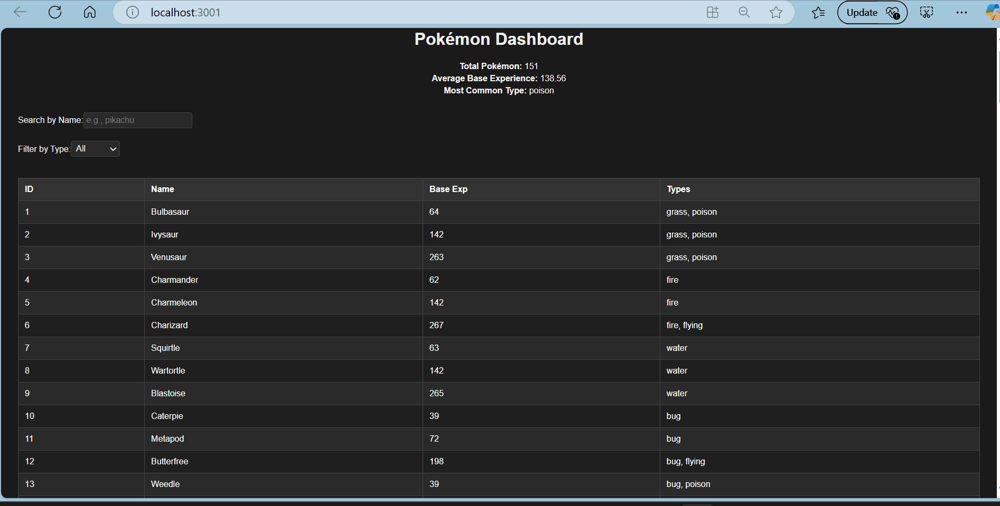

# Web Development Project 5 - Pokémon Dashboard

Submitted by: **Jafrul Amin**

This web app displays a dashboard that fetches data from the PokéAPI. It shows a list of Pokémon along with summary statistics such as total count, average base experience, and the most common Pokémon type. Users can search for Pokémon by name and filter the list by Pokémon type using a dark-themed, line-by-line layout.

Time spent: **8** hours spent in total

## Required Features

The following **required** functionality is completed:

- [x] **The site has a dashboard displaying a list of data fetched using an API call**
  - The dashboard displays at least 10 unique Pokémon, one per row.
  - Each row includes multiple features such as the Pokémon's ID, name, base experience, and types.
- [x] **`useEffect` React hook and `async`/`await` are used**
- [x] **The app dashboard includes at least three summary statistics about the data**
  - Total number of Pokémon
  - Average base experience of the Pokémon
  - Most common Pokémon type
- [x] **A search bar allows the user to search for an item in the fetched data**
  - The search bar correctly filters the Pokémon list, displaying only those that match the search query.
  - The list of results dynamically updates as the user types into the search bar.
- [x] **An additional filter allows the user to restrict displayed items by specified categories**
  - The filter restricts Pokémon by type (a different attribute than the search bar).
  - The filter correctly displays only those Pokémon matching the selected type.
  - The dashboard list dynamically updates as the user adjusts the filter.

The following **optional** features are implemented:

- [x] Multiple filters can be applied simultaneously (search by name and filter by type).
- [x] Filters use different input types:
  - A text input for the search bar and a dropdown for the type filter.
- [ ] The user can enter specific bounds for filter values (not applicable in this project).

The following **additional** features are implemented:

- [x] A dark-themed, line-by-line layout for a sleek user interface.
- [x] Responsive design to ensure usability on different screen sizes.

## Video Walkthrough

Here's a walkthrough of implemented user stories:

GIF created with ScreenToGif

## Notes

During development, one of the main challenges was managing asynchronous data fetching for multiple API calls and ensuring that the data was properly synchronized before rendering. Implementing a dark-themed, line-by-line layout also required careful CSS styling to ensure readability and a clean user interface.

## License

    Copyright [yyyy] [name of copyright owner]

    Licensed under the Apache License, Version 2.0 (the "License");
    you may not use this file except in compliance with the License.
    You may obtain a copy of the License at

        http://www.apache.org/licenses/LICENSE-2.0

    Unless required by applicable law or agreed to in writing, software
    distributed under the License is distributed on an "AS IS" BASIS,
    WITHOUT WARRANTIES OR CONDITIONS OF ANY KIND, either express or implied.
    See the License for the specific language governing permissions and
    limitations under the License.
